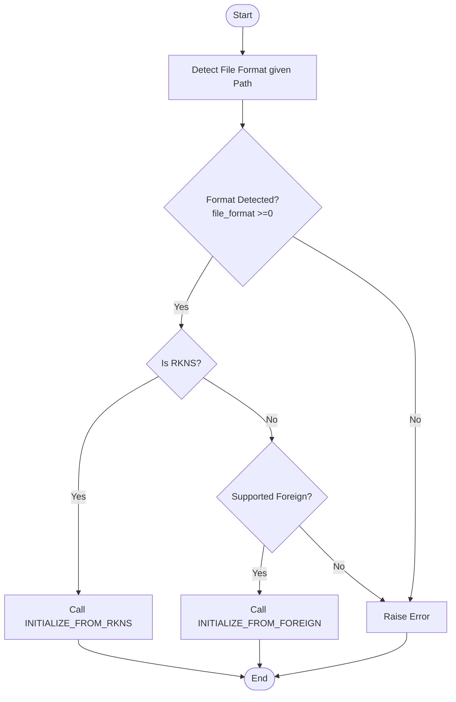
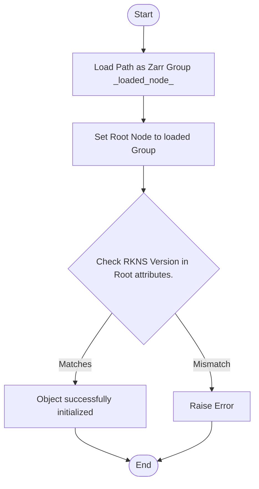
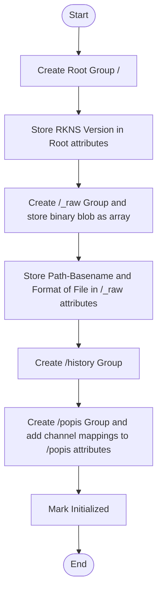
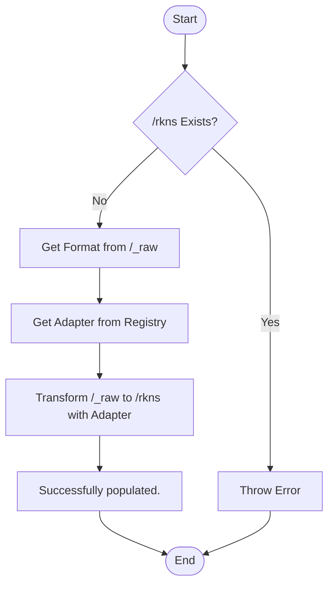
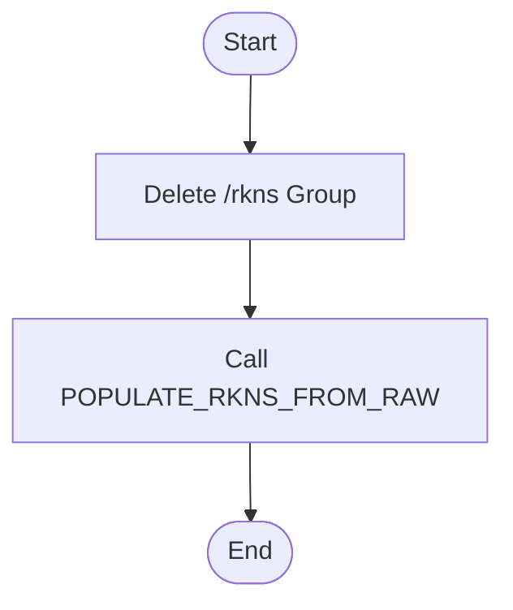

# INITIALIZE_FROM_FILE

```mermaid 
%% INITIALIZE_FROM_FILE
flowchart TD
    A([Start]) --> B["Detect File Format given Path"]
    B --> C{"Format Detected?file_format >=0"}
    C -->|Yes| D{Is RKNS?}
    C -->|No| E[Raise Error]
    D -->|Yes| F[Call INITIALIZE_FROM_RKNS]
    D -->|No| G{Supported Foreign?}
    G -->|Yes| H[Call INITIALIZE_FROM_FOREIGN]
    G -->|No| E
    F --> I([End])
    H --> I
    E --> I
```

# INITIALIZE_FROM_RKNS

```mermaid 
%% INITIALIZE_FROM_RKNS
flowchart TD
    A([Start]) --> B["Load Path as Zarr Group _loaded_node_"]
    B --> C["Set Root Node to loaded Group"]
    C --> D{Check RKNS Version in Root attributes.}
    D -->|Matches| E[Object successfully initialized]
    D -->|Mismatch| F[Raise Error]
    E --> G([End])
    F --> G
```

# INITIALIZE_FROM_FOREIGN

```mermaid 
%% INITIALIZE_FROM_FOREIGN
flowchart TD
    A([Start]) --> B[Create Root Group /]
    B --> C[Store RKNS Version in Root attributes]
    C --> D[Create /_raw Group and store binary blob as array]
    D --> E[Store Path-Basename and Format of File in /_raw attributes]
    E --> F[Create /history Group]
    F --> G[Create /popis Group and add channel mappings to /popis attributes]
    G --> H[Mark Initialized]
    H --> I([End])

```

# POPULATE_FROM_RAW

```mermaid 
%% POPULATE_RKNS_FROM_RAW
flowchart TD
    A([Start]) --> B{/rkns Exists?}
    B -->|Yes| C[Throw Error]
    B -->|No| D[Get Format from /_raw]
    D --> E[Get Adapter from Registry]
    E --> F[Transform /_raw to /rkns with Adapter]
    F --> G[Successfully populated.]
    G --> H([End])
    C --> H
```

# RESET RKNS

```mermaid
%% RESET_RKNS
flowchart TD
    A([Start]) --> B[Delete /rkns Group]
    B --> C[Call POPULATE_RKNS_FROM_RAW]
    C --> D([End])
```